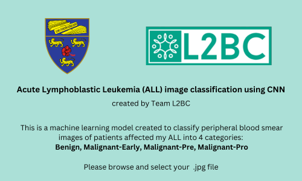

# ML-project
Python-based ALL (Acute Lymphoblastic Leukemia) Cell Image Classifier application made on a Convolutional Neural Network model.
Made under the supervision of Dr.Erma for WIA1006 - Machine Learning at Universiti Malaya.

---

---

---
